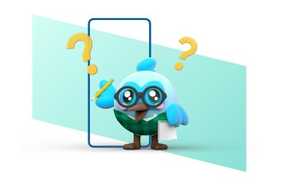

  > #  **Hii!! Its Utkarsh Shukla**             

## Little Bit About My Boring Background 
___

  > **I come from Maths background**
  >
  > - But I didn't like it so much at that time
  > - As you know we don't choose our stream, it's decided under peer pressure of class 10th

  > **Choosing *COMPUTER* in class 11th raise something, called *CURIOSITY***
  >
  > - First time I realise importance of MATHS
  > - I can't explain the joy of running a C++ code for factorial

  > **Joining the DATA SCIENCE BSC degree program of [***IIT MADRAS***](https://onlinedegree.iitm.ac.in/index.html)**
  >
  > - At that time I didn't have any clue about data science
  > - I joined this program by seeing its syllabus 
  > - And I am proud of that decision

## Little Bit About My Exciting Future Plan
***

  > **Is it really Data Science??**
  >
  > - I joined this program for learning the quality syllabus and becoming part of IIT 
  > - As of now Data Science is skill for me not a career
  > - Starting to learn Blockchain Technology and Ethical Hacking from Jan 2022  

## Little Bit About My Little Skillset
___

Till 2021, I understand topics from Maths which are required for Data Science, As of tech knowledge, I have some beginner level experience in C, C++ and Java. So i can pick up these languages in about 2 months. I have also taken Computational Thinking coursr which helped in developin an approach for solving problems.
>   

>I also started to work on Python, Flutter and github
